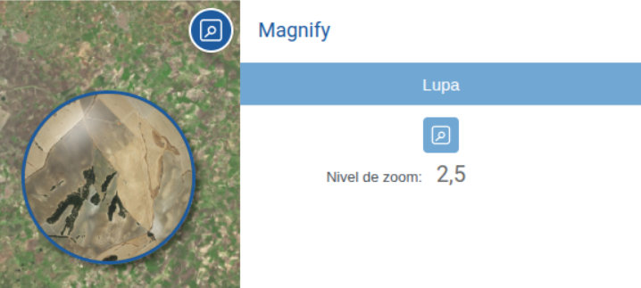

<p align="center">
  
</p>
<h1 align="center"><strong>API IDEE</strong> <small>🔌 IDEE.plugin.Magnify</small></h1>

# Descripción
Plugin que permite realizar un efecto de zoom o de lupa sobre una o varias capas



# Dependencias

Para que el plugin funcione correctamente es necesario importar las siguientes dependencias en el documento html:
Para uso de implementación OpenLayers:
- **magnify.ol.min.js**
- **magnify.ol.min.css**

Para uso de implementación Cesium:
- **magnify.cesium.min.js**
- **magnify.cesium.min.css**

# Uso del histórico de versiones

Existe un histórico de versiones de todos los plugins en el directorio `legacy/` de cada plugin.
Es recomendable fijar las versiones para evitar errores inesperados.

Ejemplo con el plugin Magnify, implementación OpenLayers y versión 2.0.0:
- **magnify-2.0.0.ol.min.css**
- **magnify-2.0.0.ol.min.js**

## Parámetros

| Parámetro | Tipo | Por defecto | Descripción |
| ----------- | ------ | ------------- | ------------- |
| `position` | `left` \| `right` | `right` | Barra de herramientas donde se muestra el botón del plugin |
| `collapsed` | `boolean` | `true` | Indica si el panel aparece colapsado al inicio |
| `order` | `number` | — | Orden del botón/panel entre controles y plugins |
| `tooltip` | `string` | `Lupa` | Texto al pasar el ratón sobre el botón |
| `layers` | `string` | — | Nombres de capas separados por comas. Si está vacío, aplica a capas base / disponibles |
| `zoom` | `number` | `1` | Zoom inicial de la lupa |
| `zoomMax` | `number` | `10` | Nivel máximo de zoom |

# API-REST

```javascript
URL_API?magnify=position*collapsed*order*tooltip*layers*zoomMax*zoom
```

| Parámetros | Opciones/Descripción | Disponibilidad |
| --- | --- | --- |
| position | left/right | Base64 ✔️ \| Separador ✔️ |
| collapsed | true/false | Base64 ✔️ \| Separador ✔️ |
| order | número | Base64 ✔️ \| Separador ✔️ |
| tooltip | texto | Base64 ✔️ \| Separador ✔️ |
| layers | nombres separados por comas | Base64 ✔️ \| Separador ✔️ |
| zoomMax | nivel máximo | Base64 ✔️ \| Separador ✔️ |
| zoom | zoom inicial | Base64 ✔️ \| Separador ✔️ |

### Ejemplos de uso API-REST

```
https://componentes.idee.es/api-idee?layers=OSM,WMTS*https://www.ign.es/wmts/pnoa-ma?*OI.OrthoimageCoverage*EPSG:25830*imagen*true*image/jpeg&projection=EPSG:25830&magnify=right*true*0*Lupa*OI.OrthoimageCoverage*16*5
```

### Ejemplo de uso API-REST en base64

```javascript
IDEE.utils.encodeBase64({
  position: 'right',
  collapsed: true,
  order: 0,
  tooltip: 'Lupa',
  zoomMax: 19,
  zoom: 5,
  layers: 'OI.OrthoimageCoverage',
});
```

## Ejemplos de uso

```javascript
const map = IDEE.map({
  container: 'map',
});

const mp = new IDEE.plugin.Magnify({
  position: 'right',
  collapsed: true,
  order: 0,
  tooltip: 'Lupa',
  zoomMax: 19,
  zoom: 5,
  layers: 'OI.OrthoimageCoverage',
});

map.addPlugin(mp);
```

# 👨‍💻 Desarrollo

Para el stack de desarrollo de este componente se ha utilizado

* NodeJS Versión: 16 o superior
* NPM Versión: 8.19.4 o superior

## 📐 Configuración del stack de desarrollo / *Work setup*

### 🐑 Clonar el repositorio / *Cloning repository*

Para descargar el repositorio en otro equipo lo clonamos:

```bash
git clone [URL del repositorio]
```

### 1️⃣ Instalación de dependencias / *Install Dependencies*

```bash
npm i
```

### 2️⃣ Arranque del servidor de desarrollo / *Run Application*

```bash
npm run start:ol
npm run start:cesium
```

## 📂 Estructura del código / *Code scaffolding*

```any
/
├── src 📦                  # Código fuente
├── legacy 📁               # Histórico de versiones
├── task 📁                 # EndPoints
├── test 📁                 # Testing
├── webpack-config 📁       # Webpack configs
└── ...
```
## 📌 Metodologías y pautas de desarrollo / *Methodologies and Guidelines*

Metodologías y herramientas usadas en el proyecto para garantizar el Quality Assurance Code (QAC)

* ESLint
  * [NPM ESLint](https://www.npmjs.com/package/eslint) \
  * [NPM ESLint | Airbnb](https://www.npmjs.com/package/eslint-config-airbnb)

## ⛽️ Revisión e instalación de dependencias / *Review and Update Dependencies*

Para la revisión y actualización de las dependencias de los paquetes npm es necesario instalar de manera global el paquete/ módulo "npm-check-updates".

```bash
# Install and Run
$npm i -g npm-check-updates
$ncu
```

## Tabla de compatibilidad de versiones
[Consulta el api resourcePlugin](https://componentes.idee.es/api-idee/api/actions/resourcesPlugins?name=magnify)
