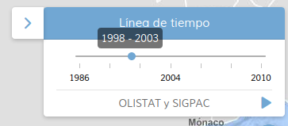
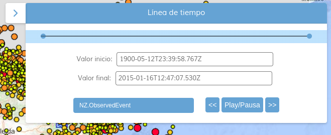
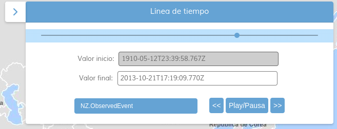

# M.plugin.Timeline

Plugin de línea del tiempo.
| timelineType AbsoluteSimple  | timelineType Absolute Relative| timelineType Absolute|
| ----------- | ----------- | ----------- |
|      |       |       |


## Dependencias

Para que el plugin funcione correctamente es necesario importar las siguientes dependencias en el documento html:

- **timeline.ol.min.js**
- **timeline.ol.min.css**


```html
 <link href="https://componentes.cnig.es/api-core/plugins/timeline/timeline.ol.min.css" rel="stylesheet" />
 <script type="text/javascript" src="https://componentes.cnig.es/api-core/plugins/timeline/timeline.ol.min.js"></script>
```

# Uso del histórico de versiones

Existe un histórico de versiones de todos los plugins de API-CNIG en [api-ign-legacy](https://github.com/IGN-CNIG/API-CNIG/tree/master/api-ign-legacy/plugins) para hacer uso de versiones anteriores.
Ejemplo:
```html
 <link href="https://componentes.cnig.es/api-core/plugins/timeline/timeline-1.0.0.ol.min.css" rel="stylesheet" />
 <script type="text/javascript" src="https://componentes.cnig.es/api-core/plugins/timeline/timeline-1.0.0.ol.min.js"></script>
```

## Parámetros


El constructor se inicializa con un JSON con los siguientes atributos:

- **position**: Indica la posición donde se mostrará el plugin.
  - 'TL': (top left) - Arriba a la izquierda.
  - 'TR': (top right) - Arriba a la derecha (por defecto).
  - 'BL': (bottom left) - Abajo a la izquierda.
  - 'BR': (bottom right) - Abajo a la derecha.

- **intervals**: Parámetro obligatorio. Array que contiene cada capa junto a sus datos, dependiendo del valor del timelinetype tendrá unos parámetros u otros.

- **timelineType**: Determina el tipo del timeline.
  - _absoluteSimple_: Representación de las capas de manera lineal, sin consultas.
  - _absolute_: Representación de las capas de manera lineal, con consultas.
  - _relative_: Representación de las capas mediante intervalos, con consultas.

  **AbsoluteSimple**: 
  - Nombre: nombre descriptivo de la capa.
  - Etiqueta: etiqueta o fecha de la capa.
  - Servicio en formato API-CNIG para insertar una capa a través de servicios WMS ó WMTS, o la capa como objeto, de cada intervalo.
  
  Ejemplos de uso
  Insertar intervalos a través de servicios WMS. La URL en formato API-CNIG sigue la siguiente estructura: Servicio,Leyenda,URL,Nombre. Separados por "*".
  ```javascript
    const mp = new M.plugin.Timeline({
    position: 'TL',
    intervals: [
      ["NACIONAL 1981-1986", "1986", "WMS*NACIONAL_1981-1986*https://www.ign.es/wms/pnoa-historico*NACIONAL_1981-1986"],
      ["OLISTAT", "1998", "WMS*OLISTAT*https://www.ign.es/wms/pnoa-historico*OLISTAT"],
      ["SIGPAC", "2003", "WMS*SIGPAC*https://www.ign.es/wms/pnoa-historico*SIGPAC"],
      ["PNOA 2004", "2004", "WMS*pnoa2004*https://www.ign.es/wms/pnoa-historico*pnoa2004"],
      ["PNOA 2005", "2005", "WMS*pnoa2005*https://www.ign.es/wms/pnoa-historico*pnoa2005"],
      ["PNOA 2006", "2006", "WMS*pnoa2006*https://www.ign.es/wms/pnoa-historico*pnoa2006"],
      ["PNOA 2010", "2010", "WMS*pnoa2010*https://www.ign.es/wms/pnoa-historico*pnoa2010"]
    ]
  });

    map.addPlugin(mp);
  ```

  **Absolute y Relative**
  - id: ID del elemento del timeline.
  - init: Fecha inicial del filtro.
  - end: Fecha final del filtro.
  - layer: Capa a filtrar.
  - attributeParam: Define el atributo de tiempo para filtrar.
  - equalsTimeLine: Filtrar por fechas iguales o entre dos fechas. 
  - grupo: Sirve para agrupar capas, tienen que tener el mismo nombre para pertenecer al grupo. Ejemplo:
  ```javascript
  intervals:[
    {
      id: '1',
      init: '1918-05-12T23:39:58.767Z',
      end: '1951-01-16T12:47:07.530Z',
      layer: capaWMS,
      grupo: 'Vectorial_WMS'
      attributeParam: 'date',
      equalsTimeLine: true
    },
    {
      id: '1',
      init: '1918-05-12T23:39:58.767Z',
      end: '2000-01-16T12:47:07.530Z',
      layer: capaVectorial,
      grupo: 'Vectorial_WMS'
      attributeParam: 'date'
    },
  ],
  ```
- **speedDate**: _Opcional_ Velocidad del Step por segundo, por defecto 2.
- **paramsDate**: _Opcional_ Determina el Step, Segundo(sec), Minuto(min), Hora(hrs), Días(day), Meses (mos), Años(yr).
- **stepValue**: _Opcional_ Determina el valor del paramsDate, por ejemplo que el step sea de 5 años. 
- **paramsDate**: _Opcional_  Determina la forma de moverte por el Slider, lineal, logarítmica o exponencial. Valor por defecto, _linear_.
  - Lineal: Valor String, _linear_. El valor del slider siempre será el mismo.
  - Exponencial: Valor String, _exponential_. Los valores iniciales del slider es mayor que los finales.
  - Logarítmica: Valor String, _logarithmic_. Los valores finales del slider es mayor que los iniciales. 
- **formatMove**: _Opcional_  Determina el movimiento del slider cuando se hace _play_. Valor por defecto, _continuous_.
  - continua: Slider mueve inicio y fin, valor String _continuous_.
  - discreta: Slider mueve solo fin, valor String _discrete_.
- **sizeWidthDinamic**: _Opcional_  Determina el tamaño del panel, sin valor y por defecto el tamaño será pequeño.
  - Mediano: Valor String, sizeWidthDinamic_medium.
  - Grande: Valor String, sizeWidthDinamic_big.

  Ejemplos de uso
  ```javascript
  const terremotos = 'WMS*Eventos sísmicos*https://www.ign.es/wms-inspire/geofisica*NZ.ObservedEvent'

  const pluginTimeline = new Timeline({
    position: 'TR',
    timelineType: 'absolute',
    intervals : [
      {
        id: '1',
        init: '1918-05-12T23:39:58.767Z',
        end: '1951-01-16T12:47:07.530Z',
        layer: terremotos,
        // grupo: 'GRUPO'
      },
    ],
    speedDate: 2,
    paramsDate:  'yr',
    formatValue: 'exponential',
    stepValue: 5,
    sizeWidthDinamic: 'sizeWidthDinamic_medium',
    formatMove: 'continuous'
  });

  map.addPlugin(pluginTimeline);
  ```
